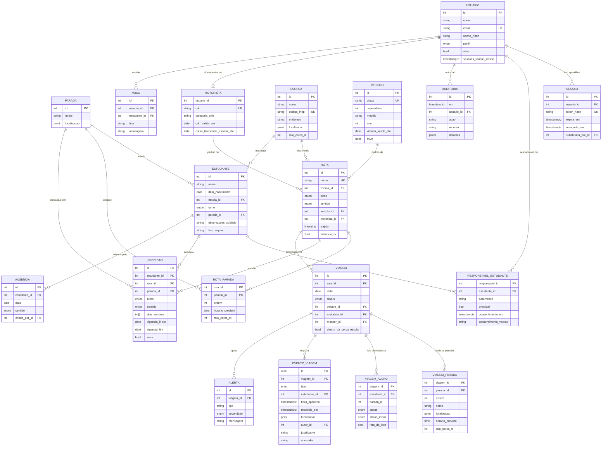

# Modelo de dados

Definido em `backend/app/models.py`. Geometrias usam SRID 4326 (WGS 84), com índice GiST. Este é o estado depois da etapa A da reformulação (ver `docs/reformulacao/README.md`); as tabelas de viagem, embarque e posição entram nas etapas B a D.

```mermaid
erDiagram
    PARADA ||--o{ ESTUDANTE : atende
    ROTA ||--o{ ROTA_PARADA : percorre
    PARADA ||--o{ ROTA_PARADA : compoe
    USUARIO ||--o{ SESSAO : "tem aparelhos"
    USUARIO ||--o{ RESPONSAVEL_ESTUDANTE : "responsavel por"
    ESTUDANTE ||--o{ RESPONSAVEL_ESTUDANTE : "tem responsavel"
    USUARIO ||--o{ AUDITORIA : "autor de"
    ESCOLA ||--o{ ROTA : "destino de"
    VEICULO ||--o{ ROTA : "padrao de"
    USUARIO ||--o| MOTORISTA : "documentos de"
    MOTORISTA ||--o{ ROTA : "padrao de"
    ROTA ||--o{ INSCRICAO : recebe
    ESTUDANTE ||--o{ INSCRICAO : embarca
    PARADA ||--o{ INSCRICAO : "embarque em"
    ESTUDANTE ||--o{ AUSENCIA : "avisada para"
    ROTA ||--o{ VIAGEM : "executada em"
    VIAGEM ||--o{ VIAGEM_PARADA : "copia as paradas"
    VIAGEM ||--o{ VIAGEM_ALUNO : "lista do motorista"
    VIAGEM ||--o{ EVENTO_VIAGEM : registra
    VIAGEM ||--o{ ALERTA : gera
    USUARIO ||--o{ AVISO : recebe

    ESCOLA { int id PK
        string nome
        string codigo_inep UK
        string endereco
        point localizacao
        int raio_cerca_m }
    ESCOLA ||--o{ ESTUDANTE : matricula
    ESTUDANTE { int id PK
        string nome
        date data_nascimento
        int escola_id FK
        enum turno
        int parada_id FK
        string observacoes_cuidado
        string foto_arquivo }
    PARADA { int id PK
        string nome
        point localizacao }
    ROTA { int id PK
        string nome UK
        int escola_id FK
        enum turno
        enum sentido
        int veiculo_id FK
        int motorista_id FK
        linestring trajeto
        float distancia_m }
    ROTA_PARADA { int rota_id PK
        int parada_id PK
        int ordem
        time horario_previsto
        int raio_cerca_m }
    VEICULO { int id PK
        string placa UK
        int capacidade
        string modelo
        int ano
        date vistoria_valida_ate
        bool ativo }
    MOTORISTA { int usuario_id PK
        string cnh UK
        string categoria_cnh
        date cnh_valida_ate
        date curso_transporte_escolar_ate }
    INSCRICAO { int id PK
        int estudante_id FK
        int rota_id FK
        int parada_id FK
        enum turno
        enum sentido
        int[] dias_semana
        date vigencia_inicio
        date vigencia_fim
        bool ativa }
    VIAGEM { int id PK
        int rota_id FK
        date data
        enum status
        int veiculo_id FK
        int motorista_id FK
        int monitor_id FK
        bool dentro_da_cerca_escola }
    VIAGEM_PARADA { int viagem_id PK
        int parada_id PK
        int ordem
        string nome
        point localizacao
        time horario_previsto
        int raio_cerca_m }
    VIAGEM_ALUNO { int viagem_id PK
        int estudante_id PK
        int parada_id
        enum status
        enum status_inicial
        bool fora_da_lista }
    EVENTO_VIAGEM { uuid id PK
        int viagem_id FK
        enum tipo
        int estudante_id FK
        timestamptz hora_aparelho
        timestamptz recebido_em
        point localizacao
        int autor_id FK
        string justificativa
        string anomalia }
    ALERTA { int id PK
        int viagem_id FK
        string tipo
        enum severidade
        string mensagem }
    AVISO { int id PK
        int usuario_id FK
        int estudante_id FK
        string tipo
        string mensagem }
    AUSENCIA { int id PK
        int estudante_id FK
        date data
        enum sentido
        int criada_por_id FK }
    USUARIO { int id PK
        string nome
        string email UK
        string senha_hash
        enum perfil
        bool ativo
        timestamptz sessoes_validas_desde }
    SESSAO { int id PK
        int usuario_id FK
        string token_hash UK
        timestamptz expira_em
        timestamptz revogada_em
        int substituida_por_id FK }
    RESPONSAVEL_ESTUDANTE { int responsavel_id PK
        int estudante_id PK
        string parentesco
        bool principal
        timestamptz consentimento_em
        string consentimento_versao }
    AUDITORIA { int id PK
        timestamptz em
        int usuario_id FK
        string acao
        string recurso
        jsonb detalhes }
```

## Perfis

`admin`, `gestor`, `motorista`, `monitor` e `responsavel`. Só `admin` e `gestor` são internos (`PERFIS_INTERNOS`) e enxergam os cadastros. Os demais acessam apenas o que um vínculo libera (filho, viagem escalada).

## Decisões

- **Distâncias em metros** são calculadas convertendo para `geography`, porque a geometria em SRID 4326 mede em graus.
- **Trajeto da rota** é a linha reta entre as paradas, na ordem cadastrada. Não segue as ruas: isso exigiria um serviço de roteamento.
- **Acesso por vínculo.** O perfil diz o que a pessoa é; o vínculo diz quais crianças ela pode ver. O responsável só vê o filho depois de registrar o consentimento (LGPD, art. 14).
- **Sessões por aparelho.** O refresh token é guardado só como hash e troca a cada uso; reuso de um token já trocado revoga todas as sessões da pessoa.
- **Auditoria só de inclusão,** sem senha nem token.
- **Dados pessoais mínimos.** Os estudantes são menores de idade: não há CPF nem endereço ou localização da casa (a parada basta), e o responsável é um usuário vinculado, não um nome em texto.
- **Foto fora do JSON.** O arquivo é reencodado (sem EXIF/GPS), guardado com nome aleatório e servido por URL assinada que vale 5 minutos. Só o gestor envia.
- **Observações de cuidado** (alergia, necessidade especial) saem só para administrador e gestor; a equipe da viagem passa a vê-las na etapa C.
- **Planejado e realizado são tabelas diferentes.** `Rota` e `Inscricao` dizem o que deveria acontecer; as viagens do dia (etapa C) registram o que aconteceu.
- **Inscrição única por turno e sentido.** Turno e sentido são copiados da rota para a inscrição só para um índice parcial único (`ativa`) impedir duas inscrições ativas iguais para a mesma criança.
- **Ponta da rota é a escola.** Na ida a última parada, na volta a primeira, precisa estar dentro do raio da cerca da escola.
- **Habilitação do motorista** (`app/habilitacao.py`): conta ativa, CNH em dia, categoria D ou E e curso de transporte escolar em dia. A viagem só começa se a regra passar.
- **Lista copiada no início.** Ao iniciar, `ViagemParada` e `ViagemAluno` são cópias da rota e das inscrições do dia; editar a rota depois não muda a lista que o motorista tem na mão.
- **Eventos imutáveis.** `evento_viagem` recusa UPDATE e DELETE por trigger no banco. O id vem do aparelho (reenviar não duplica) e o status do aluno é derivado dos eventos pela hora do aparelho, então eventos atrasados do modo offline terminam no estado certo. Correção é um novo evento do gestor, com motivo.
- **Conclusão segura (R2).** A viagem só termina com todo aluno em estado final e o evento `onibus_vazio` posterior ao último movimento. Sair da cerca da escola com criança a bordo, na ida, abre alerta crítico mesmo sem ninguém tentar concluir.
- **Removidos na etapa A:** polos, turmas, professores, matrículas, transferências e frequência, e os perfis `diretor` e `coordenador`.
